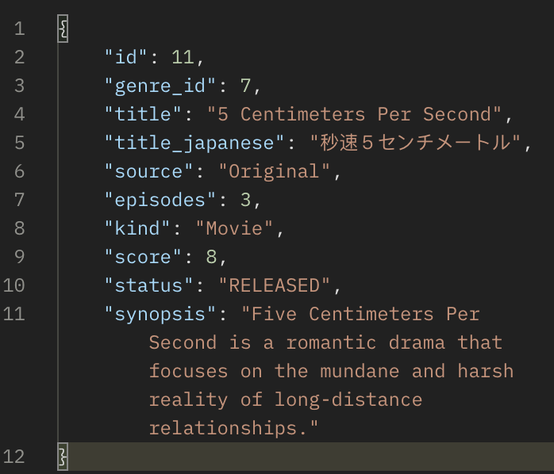

# Django Project


> ***Tech Otakus Save The World***
> 
> 
> $MiHoYo$             
> 
                  

---

# Weebnet

---

<div align="center">
  <kbd>
    
  </kbd>
</div>

## Main Idea

---

<aside>
💡 The idea is to create an anime encyclopedia (database).

</aside>

This includes anime TV series, feature films, and manga. The goal is to create a convenient API for quickly viewing the information you need. The project was inspired by sites such as shikimori.one, MyAnimeList, AniDB etc.

## Requirements
  1. Class diagram with all relations between entities
  2. Minimum 6 models
    a. model inheritance
    b. abstract model
  3. Minimum 4 model Manager
  4. Minimum 6 relations between models (ForeignKey)
  5. JWT Auth, Profile
  6. Serializer
     * a. at least 2 from serializer.Serializer
     * b. at least 2 serializer from serializer.ModelSerializer
     * c. at least 4 Serializer inheritance
     * d. at least 6 validations
     * e. Nested serializer
  7. Views
     * a. at least 2 FBV view
     * b. at least 4 CBV APIView
     * c. at least 6 ViewSet
     * d. File Upload views
  8. Django Signals - at least 4 usage
  9. Logging module for each app
  10. Well structured Postman requests with all implemented methods
      * a. separated by Folders
      * b. using Environment variables (ex: token)

### Django Side
3. Install `virtualvenv` if you don't have it
``` Shell
$ pip install virtualenv
```
4. Create virtualenv
``` Shell
$ virtualenv .venv
```
5. Activate virtualenv
``` Shell
$ source .venv/bin/activate
```
6. Then can install all the required dependencies:
``` Shell
$ cd Weebnet
$ pip install -r requirements.txt
```
## Run The App
To start the backend django server run
``` Shell
python manage.py runserver
```  
From the `Weebnet` folder. Server will be running on `http://localhost:8000/`

## Models

---


<aside>
🚀 There can be models with which you can make **CRUD** operations like:

</aside>

1. Anime
2. Manga
3. Ranobe
4. Genres
5. User
6. Comments

---

## Demo API

<aside>
👘 This is just predicted example of `GET` request via **Postman**

</aside>

---




---

## Database

<aside>
🐘 Did you really name your son `Okabe; DROP TABLE users;`

</aside>

> PostgreSQL has been designed to reliably store your most valuable asset – your data.
> 

- Benefits of PostgreSQL
    - Open Source
    - Reduce Costs
    - Security
    - Scalability


---

## Endpoints

<aside>
🦉 Corrects endpoints always better than incorrect endpoints

</aside>

| Endpoint | Description |
| --- | --- |
| GET /api/anime/ | List of all anime |
| GET /api/anime/:id/ | Show an anime by id |
| GET /api/characters/search/ | Search characters |
| GET /api/users/ | List users |
| POST /api/anime/:id/comments/ | Create a comment |

---

## Deploy

<aside>
🚢 There are many **cloud computing** services: DigitalOcean, Microsoft Azure, AWS, etc...

</aside>

If I will have enough time I would deploy my backend API on some cloud server. I think it should be good practice for me as backend developer.


### ← **No, not this one Azure**

### **you didn’t see anything**

### This one is correct →


---

## Conclusion

<aside>
🔚 If you've read this far, I feel sorry for you.

</aside>

Let’s summarize. The report has described the Django project “**Weebnet”**. And maybe (who knows?) one day such an application as "Weebnet" will really appear in the world and will unite all weeb people around the world! Thank you for your attention.


---

## License
This repository is released under the [MIT license](LICENSE.md). In short, this means you are free to use this software in any personal, open-source or commercial projects. Attribution is optional but appreciated.


```jsx
let sanzhar = {
  pronouns: "He" | "Him",
  code: ["Python", "C#", "Java", "Golang"],
  askMeAbout: ["backend dev", "student", "anime"],
  technologies: {
    mobileApp: ["Kotlin"],
    frontEnd: {
      js: ["Angular"],
      css,
      html,
    },
    backEnd: {
      Golang,
      Python: ["Django", "FastAPI"],
    },
    devOps: ["Docker🐳"],
    databases: ["mongoDB", "PSQL"],
    deploy: ["DigitalOcean", "AWS", "Azure", "Oracle"]
  },
  currentProject: "Weebdev 🍡",
  funFact: "I am not funny",
};
```